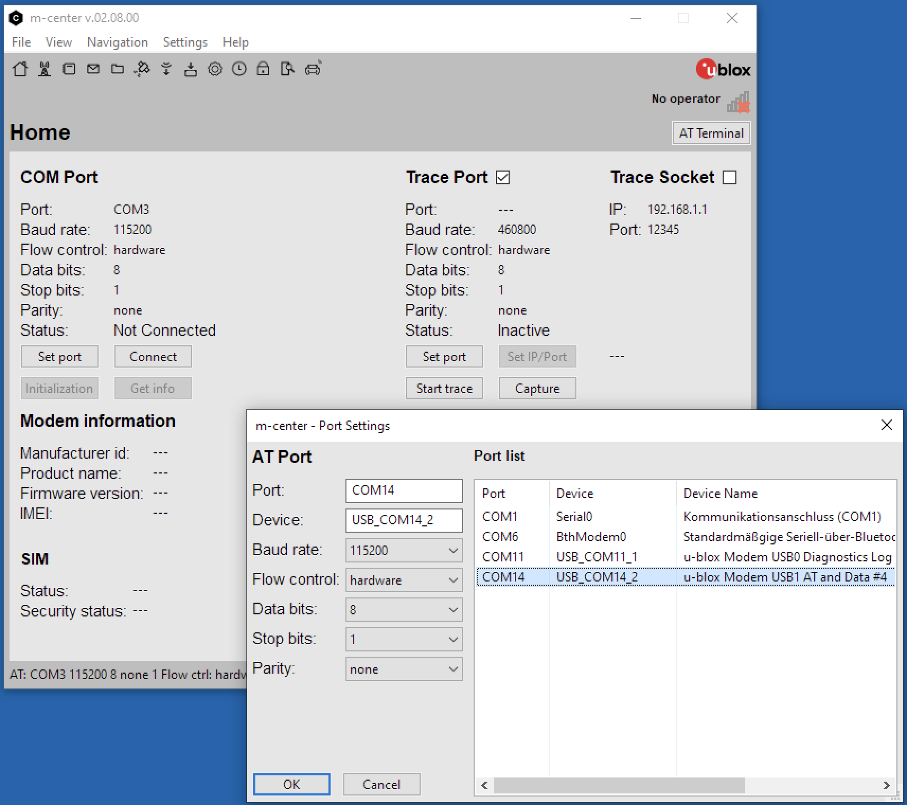
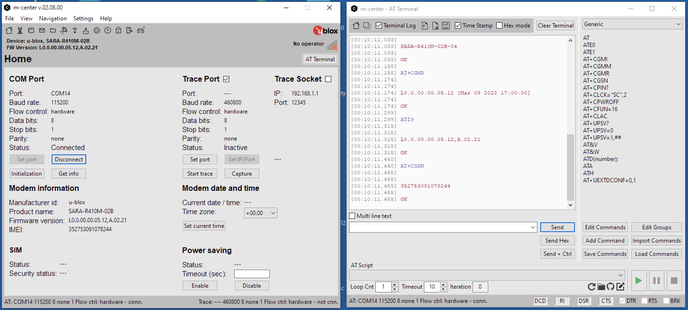

# Particle Boron u-blox SARA-R4 Firmware Programmer 

Back in 2018, I bought a few Borons from Particle. The Boron firmware has been updated several times since then, but Particle has not delivered a firmware update for the u-blox SARA-R410M-02B modem found on the boron. U-blox has since released several updated firmware versions. The Firmware Programmer below allows you to connect directly to the USB of the u-blox module in order to communicate with it using AT commands or to update its firmware.

The latest firmware version from u-blox can be downloaded here: 
[SARA-R4 / Documentation & resources](https://www.u-blox.com/en/product/sara-r4-series?legacy=Current#Documentation-&-resources) -> Firmware Update -> SARA-R410M-02B-0x IP FW package

Latest Version (as of 21st April 2022): SARA-R410M-02B-04: Modem: L0.0.00.00.05.12 / Application: A.02.21

## Printed Circuit Board 
I'm sharing the PCB design on  OSH Park. OSH Park produces high quality PCBs for little money. 

OSH Park [Boron-ublox-FW-Programmer](https://oshpark.com/shared_projects/7IBDIvOl).

The programmer can be built with either USB jack or USB cable, depending on which fits best your needs. For the version with USB cable I used one of the USB cables that Particle supplied with their development kits.

 Programmer with USB jack |  Programmer with USB cable |
|:---:|:---:| 

### Bill of Materials

| No. | Qty. | Mouser Part No.                                                                                   | Description                                     |
| --: | ----:| -------------------------------------------------------------------------------------------------:| -----------------------------------------------:|
| 1.  |    1 | [485-2886](https://www.mouser.ch/ProductDetail/Adafruit/2886?qs=xE9dPqTLfL61eEvyw283TQ%3D%3D)     | Feather 12 / 16-Pin Female Header Set           |
| 2.  |    1 | [485-2430](https://www.mouser.ch/ProductDetail/Adafruit/2430?qs=GURawfaeGuDsBQlXUxEF%252BA%3D%3D) | Pogo Pins Needle Head (10 pack) - P75-B1        |
| 3.  |    1 | [490-UJ2-MIBH2-4-SMT](https://www.mouser.ch/ProductDetail/490-UJ2-MIBH2-4-SMT)                    | USB Connectors USB 2.0 Micro B Jack             |

## Building the Firmware Programmer

1. Solder the USB jack or the USB cable to the PCB (I recommend fixing the USB cable with a zip tie to the PCB as shown above). 
2. Solder the two female headers to the PCB. 
3. Soldering the pogo pins requires a simple trick, which helps to align the pins precisely and ensures sufficient contact force. 
	1. Build a sandwich of the programmer, an empty programmer PCB and a Boron as shown below.
	2. Put the pogo pins through the pads from the bottom and check that they are well alinged with the test points. 
	3. Solder the pogo pins without applying force to the pins.
	
	
	
4. Remove the empty PCB used for alignment and spacing.
5. Check the correct alignment and contact force of the pogo pins by mounting the Boron directly onto the programmer.

**Congratulations you successfully built the Boron u-blox SARA-R4 Firmware Programmer!**

## Updating the Boron u-blox SARA-R4 Module Firmware
### Preparation 
1. ***Update the Boron to the latest firmware:*** I recommend updating the Boron to the latest firmware version before updating the u-blox module. The easiest way to do this is using the particle CLI. 
	1. Put your device into DFU mode (blinking yellow). Instructions see [Status LED - Boron](https://docs.particle.io/troubleshooting/led/boron/).
	2. From a terminal window run the command `particle update` 

2. ***Install USB Driver for Windows:*** Install the SARA-R4 Windows driver [SARA-R4 / Documentation & resources](https://www.u-blox.com/en/product/sara-r4-series?legacy=Current#Documentation-&-resources)  -> Driver -> ublox_R4_R6_L6_windows_3264_v2.0.0.0.zip
3. ***Check if Windows recognizes the programmer with Boron installed***: 
	1. Remove all connections from the Boron, install it on the programmer and connect the programmer to your PC. This will power up your Boron.
	2. Check in the Windows device manager if a new USB device "u-blox USB Composite Device 90B2" and new COM port "u-blox Modem USB0 Diagnostics Log" pop up.  
	3. IMPORTANT: Put your Boron into DFU mode (yellow blinking). This prevents the Boron form starting up and sending AT commands to the u-blox module, which will cause the update to fail. See [Status LED - Boron](https://docs.particle.io/troubleshooting/led/boron/)
	4. IMPORTANT 2: The Particle firmware powers up the u-blox module at startup. This is done using port P0.16 see [Boron Datasheet](https://docs.particle.io/reference/datasheets/b-series/boron-datasheet/). If the firmware of the Boron for some reason has been completely erased, the ublox module will NOT start up! 
   
4. ***Optional: Test connectivity using u-blox m-center***
   1. Download & install the [u-blox m-center](https://www.u-blox.com/en/product/m-center)
   2. Set port to *u-blox Modem USB AT und Data*
   
   
   
   3. Set the COM port to 115200 Baud, 8, N, 1.
   4. Hit *Connect* to connect to the modul. The terminal program will run a couple of AT commands to test the modul (see below). 
   
   

   5. Enter *ATI* to display the modem identification information

5. ***Install u-blox EasyFlash tool:*** 
	1. Download and install the latest [EasyFlash Tool](https://content.u-blox.com/system/files/EasyFlash_13.03.1.2.zip?hash=rG0hfY558j8FTMU3NbbeXx8nWrm1wAaRLFzrC_sUsZo). You should get something like EasyFlash_xx.yy.msi.
   
6. ***Download the latest Firmware for the u-blox SARA-R410M module***
    1. Download the latest Firmware from [SARA-R4 / Documentation & resources](https://www.u-blox.com/en/product/sara-r4-series?legacy=Current#Documentation-&-resources)  -> Firmware Update -> SARA-R410M-02B-04 IP FW package. Latest version released: *SARA-R410M-02B-04 IP FW package*, Release Date 29-Jun-2023 (Modem: L0.0.00.00.05.12, Application: A.02.21).
    2. Unzip the firmware image (e.g. SARA-R410M-02B-04-P1-L0000000512A0221-000K00.dof) to the root directory of the EasyFlash tool. -> C:\Program Files (x86)\U-blox\EasyFlash_13.03.1.2. IMPORTANT: The firmware file has to be in the root of the EasyFlash tool. The feature *enable File browsing* (Menu: Tools/Enable file browser) did not work for me. -> The update process failed!
	3. Read the Readme & firmware update notes.
   
	INFO: The first Borons were shipped with module type number SARA-R410M-02B-00 (Modem: L0.0.00.00.05.06, Application: A.02.00).

### Updating the modem firmware
1. Follow this guide [Firmware update with uFOTA, FOAT and EasyFlash](https://www.u-blox.com/docs/UBX-17049154) (EasyFlash see chapter 8) to install the u-blox SARA-R4 Firmware.
2. IMPORTANT: Run EasyFlash as an administrator!
3. Settings: Product: SARA-R4, Port: USB, Baud rate: <empty>
4. Flashing the modem takes approx. 2-3 minutes.

  

***Congratulations you successfully updated the u-blox SARA-R4 Firmware !!!***

 