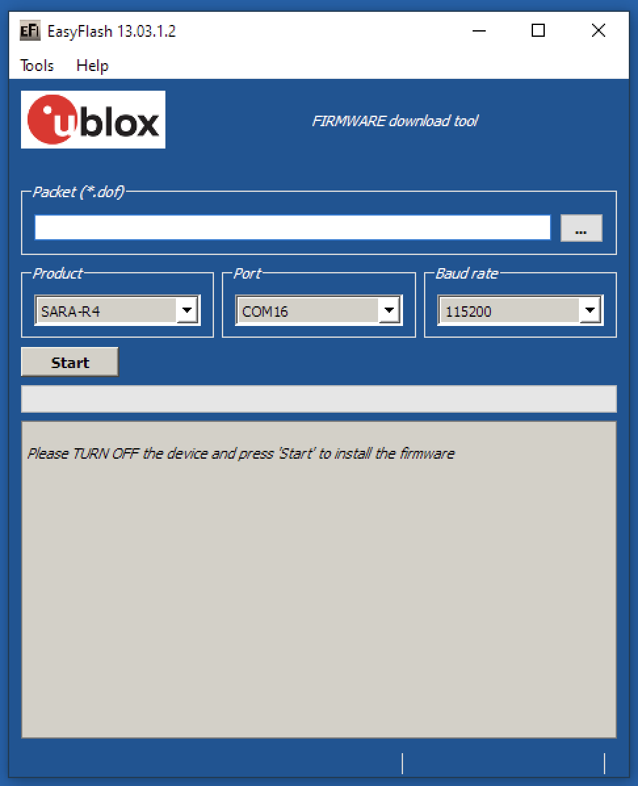

# Particle Boron ublox SARA-R4 Firmware Programmer 

I bought a few Borons over a year ago. The Boron firmware has been updated several times since then, but Particle has not yet delivered a firmware update for the ublox SARA-R4 modem (firmware L0.0.00.00.05.06 [Feb 03 2018]).

The latest firmware version (L0.0.00.00.05.08 / App version 02.04 [Mai 20 2019]) contains many improvements, such as new MNO profiles and many more. I wanted to try out the new features and therefore created this firmware programmer.

The product change notes can be found here [SARA-R410M-02B-01 Product Change](https://www.u-blox.com/en/docs/UBX-19024506).
Futher documentation & resouces can be found here [SARA-R4 Series Documenation & Resources](https://www.u-blox.com/en/product/sara-r4-series?lang=de#tab-documentation-resources).

As far as I can see does the ublox firmware version L0.0.00.00.05.8 work just fine with the current firmware version 1.5 of the Boron.

## Printed Circuit Board 
I'm sharing the PCB design on  OSH Park. OSH Park produces high quality PCBs for little money. 

OSH Park [Boron-ublox-FW-Programmer](https://oshpark.com/shared_projects/7IBDIvOl).

The programmer can be built with either USB jack or USB cable, depending on which fits best your needs. For the version with USB cable I used one of the USB cables that Particle supplied with their development kits.

 Programmer with USB jack |  Programmer with USB cable |
|:---:|:---:| 

### Bill of Materials

| No. | Qty. | Mouser Part No.                                                                | Description                              |
| --: | ----:| ------------------------------------------------------------------------------:| ----------------------------------------:|
| 1.  |    1 | [485-2886](https://www.mouser.ch/ProductDetail/Adafruit/2886)                  | Feather - 12 / 16-pin Female Header Set  |
| 2.  |    1 | [485-2430](https://www.mouser.ch/ProductDetail/Adafruit/2430)                  | Pogo Pins Needle Head (10 pack) - P75-B1 |
| 3.  |    1 | [490-UJ2-MIBH2-4-SMT](https://www.mouser.ch/ProductDetail/490-UJ2-MIBH2-4-SMT) | USB Connectors USB 2.0 micro B jack      |

## Building the Firmware Programmer

1. Solder the USB jack or the USB cable to the PCB (I recommend fixing the USB cable with a zip tie to the PCB as shown above). 
2. Solder the female headers to the PCB. 
3. Soldering the pogo pins requires a simple trick, which helps to align the pins precisely and ensures sufficient contact force. 
	1. Build a sandwich of the programmer, an empty programmer PCB and a Boron as shown below.
	2. Put the pogo pins through the pads from the bottom and check that they are well alinged with the test points. 
	3. Solder the pogo pins without applying force to the pins.
	
	
	
4. Remove the empty PCB used for alignment and spacing.
5. Check the correct alignment and contact force of the pogo pins by mounting the Boron directly on to the programmer.

**Congratulations you successfully built the Boron ublox SARA-R4 Firmware Programmer!**

## Updating the Boron ublox SARA-R4 Module Firmware
### Preparation 
1. ***Updating Boron to the latest Firmware:*** I recommend updating the Boron to the latest firmware version before updating the ublox module. The easiest way to do this is using the particle CLI. 
	1. Put your device into DFU mode (blinking yellow), instructions [here](https://docs.particle.io/tutorials/device-os/led/#dfu-mode-device-firmware-upgrade-).
	2. From a terminal window run the command `particle update` 
2. ***Install ublox EasyFlash tool:*** 
	1. Get the latest EasyFlash tool (Windows only) and SARA-R410M Firmware from ublox (write to info@ublox.com) and install it. Unfortunately these files are not publicly available. You should get something like EasyFlash_10.02.msi and SARA-R410M-02B-01-L0.0.00.00.05.08_A.02.04_IP.zip.
	2. Unzip the firmware image and copy the file "SARA-R410M-02B-01-L0_0_00_00_05_08.dof_updated.dof" to the EasyFlash directory.
3. ***Install USB Driver:*** Install the SARA-R4 USB Windows Driver (Qualcomm) from here [Documentation & Resources](https://www.u-blox.com/en/product/evk-r4#tab-documentation-resources)
3. ***Check if Windows recognizes the programmer with Boron installed***: 
	1. Remove all connections from the Boron, install it on the programmer and connect the programmer to your PC. This will power up your Boron.
	2. Check in the Windows device manager if a new USB device "Qualcomm USB Composite Device 90B2" and COM port "Qualcomm HS-USB Diagnostics 90B2 (COMx)" pop up.  
	3. IMPORTANT: Put your Boron into DFU mode (yellow blinking). This prevents the Boron form starting up and sending AT commands to your ublox module, which will cause the update to fail.

### Updating the modem firmware
1. Follow this guide (EasyFlash see chapter 8) to install the ublox SARA-R4 Firmware [Firmware update with uFOTA, FOAT and EasyFlash](https://www.u-blox.com/sites/default/files/SARA-R4-FW-Update_AppNote_%28UBX-17049154%29.pdf)
2. Settings: Product: SARA-R4. Port: USB
3. Flashing the modem takes approx. two minutes.

***Congratulations you successfully updated the ublox SARA-R4 Firmware !***

## Connect to the ublox modem using m-center
ublox provides a handy evaluation software, which lets you directly communicate with the ublox SARA-R4 modem (Serial over USB) using AT-Commands (other Terminal Software work too).

1. Download and install the software. [ublox m-center](https://www.u-blox.com/en/product/m-center)
2. Set the COM port, 115200, 8, N, 1 and hit connect.
3. The modem information should be displayed in the bottom left. 
4. Klick on the "AT Terminal" button (top right) to open up the Terminal window.
5. Try "ATI" to display the modem idenfication information

The AT commands manual can be found here [SARA-R4 AT Commands Manual](https://www.u-blox.com/en/docs/UBX-17003787)

 